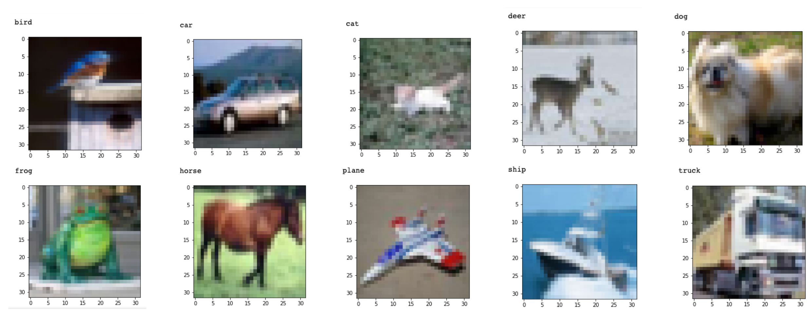

# Data Scientist Nanodegree
# Deep learning with Pytorch
## Project: CIFAR-10 Image Classifier

## Scenario
You are a new machine learning engineer at a self-driving car startup. Management is trying to decide whether to build or buy an object detection algorithm for objects that may be on the side of the road. They are considering buying a computer vision algorithm from a company called Detectocorp. Detectocorp’s algorithm claims a 70% accuracy rate on the CIFAR-10 dataset, a benchmark used to evaluate the state of the art for computer vision systems.

But before making this purchase, management wants to explore whether you can build an in-house solution that performs well. They have asked you to try your hand at creating a neural network that can classify arbitrary objects and potentially be fine-tuned on a larger dataset using transfer learning.

Using the skills you’ve acquired building neural networks using PyTorch, your task is to build an image classifier using the CIFAR-10 dataset and evaluate its accuracy. Then you'll compare its performance to both Detectocorp’s algorithm (which achieved 70% accuracy) as well as the state of the art results detailed in the notebook—and make a recommendation to management about whether to build the solution in-house or buy the algorithm from Detectocorp.

## CIFAR-10
Your image classifier will be trained and evaluated on one of the most classic and well-studied computer vision data sets, CIFAR-10. This dataset has spurred loads of innovation in neural network design and implementation. The current state of the art is a 99% accuracy rate, achieved by GPipe, which has 557 million parameters and was developed in late 2018. GPipe is an extremely large network with a lot of advanced techniques not introduced in this course, but feel free to use any architecture that suits your needs.

Your classifier should be able to classify images like these:




The following are the main steps of this project. The notebook also contains instructions and hints that will guide you through this process:

Explore and prepare the data for training and testing.
Design and build your neural network.
Train the neural network on the training set.
Evaluate your network's performance on the test set.
Make a recommendation on the build vs. buy business decision.


### Install

This project requires **Python 3.x** and the following Python libraries installed:

import torch
import torch.nn as nn
import torch.nn.functional as F
import torch.optim as optim
import torchvision
import torchvision.transforms as transforms
import matplotlib.pyplot as plt
import numpy as np
import time
!curl -O https://raw.githubusercontent.com/udacity/workspaces-student-support/master/jupyter/workspace_utils.py

You will also need to have software installed to run and execute an [iPython Notebook](http://ipython.org/notebook.html)

We recommend students install [Anaconda](https://www.continuum.io/downloads), a pre-packaged Python distribution that contains all of the necessary libraries and software for this project.

### Code

Template code is provided in the `CIFAR-10_Image_Classifier-STARTER.ipynb` notebook file.

### Run

In a terminal or command window, navigate to the top-level project directory `finding_donors/` (that contains this README) and run one of the following commands:

```bash
ipython notebook CIFAR-10_Image_Classifier-STARTER.ipynb
```  
or
```bash
jupyter notebook CIFAR-10_Image_Classifier-STARTER.ipynb
```

This will open the iPython Notebook software and project file in your browser.

### Data

https://www.cs.toronto.edu/~kriz/cifar.html

The CIFAR-10 dataset consists of 60000 32x32 colour images in 10 classes, with 6000 images per class. There are 50000 training images and 10000 test images.

The dataset is divided into five training batches and one test batch, each with 10000 images. The test batch contains exactly 1000 randomly-selected images from each class. The training batches contain the remaining images in random order, but some training batches may contain more images from one class than another. Between them, the training batches contain exactly 5000 images from each class.

**Features**
- image - 3x32x32 image.

**Target Variable**
- `class`: 1 of 10 classes: 
airplane										
automobile										
bird										
cat										
deer										
dog										
frog										
horse										
ship										
truck										

